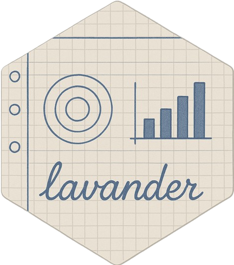

<!-- README.md is generated from README.Rmd. Please edit that file -->

# booklet <a href=#></a>

<!-- badges: start -->

[](https://cran.r-project.org/package=booklet)
[](https://cran.r-project.org/package=booklet)

[](https://github.com/alexym1/booklet/actions/workflows/R-CMD-check.yaml)
[](https://app.codecov.io/gh/alexym1/booklet?branch=master)
<!-- badges: end -->

> Multivariate exploratory data analysis in R

## Overview

`booklet` is a ground-up rewrite of
[FactoMineR](https://github.com/husson/FactoMineR/tree/master) that
provides a set of functions for multivariate exploratory data analysis.
It is designed to be a more user-friendly version of `FactoMineR`. The
main goal was to make the package more intuitive and easier to use. The
package is still under development, and some functions are not yet
implemented. However, the main functions are already available.

## Installation

The `booklet` package can be installed from CRAN as follows:

``` r
install.packages("booklet")
```

The latest version can be installed from GitHub as follows:

``` r
# install.packages("pak")
pak::pak("alexym1/booklet")
```

## Example

``` r
library(booklet)

# Get active individuals
X_active <- pca_standardize_norm(iris[, -5])
head(X_active)
#>   Sepal.Length Sepal.Width Petal.Length Petal.Width
#> 1   -0.8976739  1.01560199    -1.335752   -1.311052
#> 2   -1.1392005 -0.13153881    -1.335752   -1.311052
#> 3   -1.3807271  0.32731751    -1.392399   -1.311052
#> 4   -1.5014904  0.09788935    -1.279104   -1.311052
#> 5   -1.0184372  1.24503015    -1.335752   -1.311052
#> 6   -0.5353840  1.93331463    -1.165809   -1.048667
```

``` r
# Get eigs
eigs <- pca_eigen(X_active)
eigs$values
#> [1] 434.856175 136.190540  21.866774   3.086511
```

``` r
# Get principal components
ind_coords <- pca_ind_coords(eigs)
head(ind_coords)
#>       Dim.1      Dim.2       Dim.3        Dim.4
#> 1 -2.257141 -0.4784238  0.12727962  0.024087508
#> 2 -2.074013  0.6718827  0.23382552  0.102662845
#> 3 -2.356335  0.3407664 -0.04405390  0.028282305
#> 4 -2.291707  0.5953999 -0.09098530 -0.065735340
#> 5 -2.381863 -0.6446757 -0.01568565 -0.035802870
#> 6 -2.068701 -1.4842053 -0.02687825  0.006586116
```

## Code of conduct

Please note that this project is released with a [Contributor Code of
Conduct](https://alexym1.github.io/booklet/CONTRIBUTING.html). By
participating in this project you agree to abide by its terms.

## Acknowledgments

This logo was created by
[@obstacle.graphic](https://linktr.ee/obstacle.graphic).
